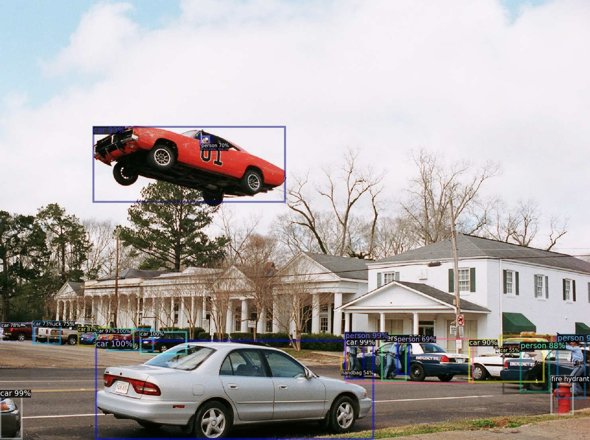

#MCV-M5 Visual Recognition Project: Object Detection and Segmentation
## Scene Understanding for Autonomous Driving

### [Paper](https://arxiv.org/abs/2105.04905)

## Summary
This repository contains the code related to the project on 'Object Detection and Segmentation' of the [Module 5: Visual Recognition](https://pagines.uab.cat/mcv/content/m5-visual-recognition) of the Master in Computer Vision at UAB. 

The aim of this master module is to study the behaviour of different configurations of RetinaNet, Faster R-CNN and Mask R-CNN (from [Detectron2](https://github.com/facebookresearch/detectron2)) by a qualitative and quantitative evaluation on KITTI-MOTS, MOTSChallenge and out of context datasets.

The module consists of 5 different deliveries that build up to a complete pipeline. Refer to the specifics `README.md` for further explanations, requirements and the complete code of each week.
## Week 1
- [code and documentation](https://github.com/IanRiera/MCV-M5/tree/main/week1)
- [slides](https://docs.google.com/presentation/d/1h5jdP4lXGR8VgvhVh47yqUHJ9bJFIs4zSOKA_SLklZ4/edit?usp=sharing)

## Week 2
- [code and documentation](https://github.com/IanRiera/MCV-M5/tree/main/week2)
- [slides](https://docs.google.com/presentation/d/1vZrX3xlyCbwh5ykgPnVMY2CsR5FlvhLXxBoS3dFYsWE/edit?usp=sharing)
- [Review of SOTA](https://www.overleaf.com/read/bczqrzwrgykr)

## Week 3
- [code and documentation](https://github.com/IanRiera/MCV-M5/tree/main/week3)
- [slides](https://docs.google.com/presentation/d/1xrv3KUThOgp_U02eDem_Zr682JJpCaO0sxU3Aw7qRFI/edit?usp=sharing)
- [Experiments section added on Overleaf](https://www.overleaf.com/read/xmtnnfydjtdb)

## Week 4
- [code and documentation](https://github.com/IanRiera/MCV-M5/tree/main/week4)
- [slides](https://docs.google.com/presentation/d/1J4Hdr2Lo8MQL4JE1Jc5x9-D2dtSdhhjgJFk4IyQQHZ0/edit?usp=sharing)
- [Experiments section updated on Overleaf](https://www.overleaf.com/read/rjyzfhbjgzxt)

# Week 5
- [code and documentation](https://github.com/IanRiera/MCV-M5/tree/main/week5)
- [slides](https://docs.google.com/presentation/d/1F6EdDpjl0oWy2dfl9S0vbGN5zTEdXxRNTPppgK4JD44/edit?usp=sharing)
- [Final Report (Overleaf)](https://www.overleaf.com/read/dgfzcrshhygj)

## Contributors: Team 02
- Òscar Lorente Corominas ([email](mailto:oscar.lorentec@e-campus.uab.cat))
- Ian Riera Smolinska ([email](mailto:ianpau.riera@e-campus.uab.cat))
- Aditya Sangram Singh Rana ([email](mailto:adityasangramsingh.rana@e-campus.uab.cat))
